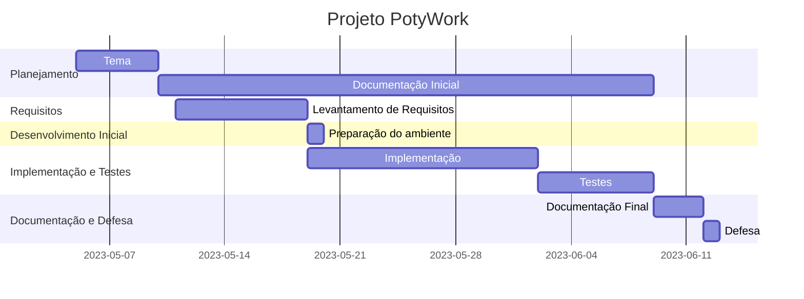

# Automação de uma plataforma de trabalho freelance online 

### Cronograma de atividades - gantt

* Projeto integrador

## Cronograma de atividades

## Planejamento

### Tema

O tema escolhido foi tomado por base em outro sistema já existente, com implementações de melhor usabilidade

### Documentação Inicial

Aqui, dou início a pesquisa, definição e documentação inicial das etapas do processo, que segue até a fase de implementação e testes

## Levantamento de Requisitos

Definição dos requisitos, com uma visão dos possíveis problemas e suas respectivas soluções.

## Preparação do ambiente e Implantação

Escolha das tecnologias que serão usadas no desenvolvimento do software e construção de um protótipo.

## Implementação e Testes

Execução dos testes com a aplicação para a verificação de possíveis erros.

## Documentação e Defesa

Apresentação do projeto com slides e telas

### Integração com as disciplinas

A plataforma PotiWork usará as tecnologias Next (frontend), Node (backend) e Postgress (banco).

Para o Front-End, optei pelo Next por causa da minha familiaridade com o trabalho, bem como NodeJs para Back-end e Postgress para o Banco.

## Diagrama de Componentes - Dimenlogia

