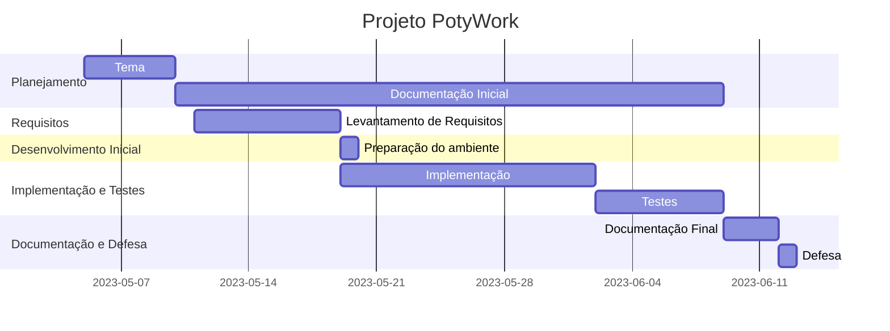

# Automação de uma plataforma de trabalho freelance online 

### Cronograma de atividades - gantt

* Projeto integrador

## Cronograma de atividades

## Planejamento

### Tema

O tema escolhido foi tomado por base em outro sistema já existente, com implementações de melhor usabilidade

### Documentação Inicial

Aqui, dou início a pesquisa, definição e documentação inicial das etapas do processo, que segue até a fase de implementação e testes

### Documentação Telas
I - PÁGINAS

Tela 1 - Na tela de início (HOME), além do NavBar, existe um pouco sobre a proposta no título "Mostre o seu Talento".
Nesta mesma página, é possível encontrar as regras e diretrizes do site (PDF, disponível para download em "VER REGRAS").
Também, é possível contratar, oferecer e visualizar cursos relacionados à área.

Tela 2 - Aqui, é possível visualizar profissionais em diversas formações da área de desenvolvimento, tais como: Web Developer, Front-end, Back-end e outros.

Tela 3 - É apresentada a equipe responsável pela plataforma, que vai tanto dos profisisonais envolvidos no desenvolvimentos como os que atuam na área de gestão e contabilidade da empresa.

Tela 4 - Tem a história da empresa, como ela foi idealizada, como surgiu, quando, quem são os responsáveis, enfim.

Tela 5 - Há um painel com todos os serviços prestados que envolvam o contrato tanto da solicitação de uma prestação de serviço, quanto que da própria prestação de serviço.

Tela 6 - A última tela é a "Fale Conosco", cuja qual o usuário terá a possibilidade de contato mais direto com os idealizadores do projeto.

II - GERENCIADOR

Tela 1 - É a tela de LOGIN, na qual o usuário vai entrar em seu ambiente virtual. Caso este usuário não possua cadastro, é possível realizá-lo através da subtela (cadastro). Caso tenha, basta preencher os itens e clicar em ENTRAR.

Tela 2 - No ambiente do usuário existe um NAVBAR, onde é possivel publicar um projeto clicando no botão "PUBLIQUE UM PROJETO".
Neste mesmo componente encontram-se as sinalizações de notificação (contatos, mensagens de outros usuários, contratos e outros), representados por um sino.

Também, a área de PERFIL DO USUÁRIO, na qual consta as configurações deste e sobre a acessibilidade.

Ainda nesta tela, encontram-se Cards que direcionam para outras telas, são elas:

Card FREELANCERS - Encaminha à uma tela da rede de contatos com outros profissionais, clientes e ou empresas.

Card CONTRATOS - O qual consta todos os contratos e status deste usuário.

Card PORTFÓLIO - Apresenta a tela com todos os trabalhos realizados por este usuário, tanto como desenvolvedor, quanto que cliente.

Card FINANÇAS - Direciona para a tela que apresenta as transações financeiras realizadas por este usuário e ou empresa.

## Levantamento de Requisitos

Definição dos requisitos, com uma visão dos possíveis problemas e suas respectivas soluções.

## Preparação do ambiente e Implantação

Escolha das tecnologias que serão usadas no desenvolvimento do software e construção de um protótipo.

## Implementação e Testes

Execução dos testes com a aplicação para a verificação de possíveis erros.

## Documentação e Defesa

Apresentação do projeto com slides e telas

### Integração com as disciplinas

A plataforma PotiWork usará as tecnologias Next (frontend), Node (backend) e Postgress (banco).

Para o Front-End, optei pelo Next por causa da minha familiaridade com o trabalho, bem como NodeJs para Back-end e Postgress para o Banco.

## Diagrama de Componentes - PotiWork

